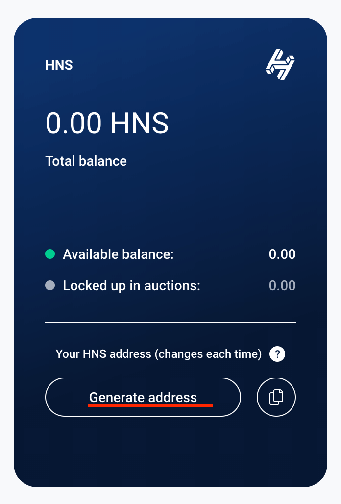
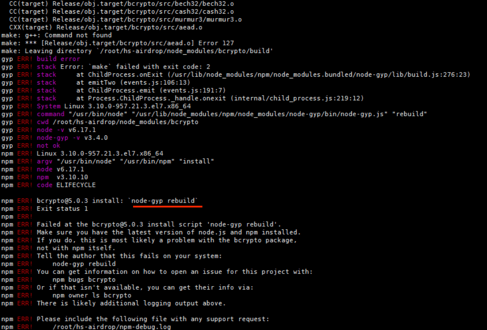
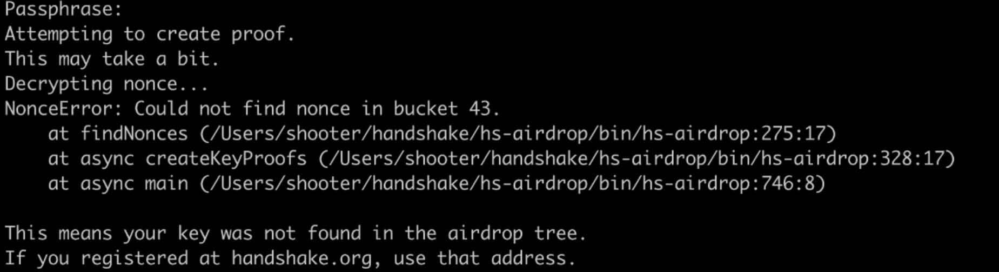
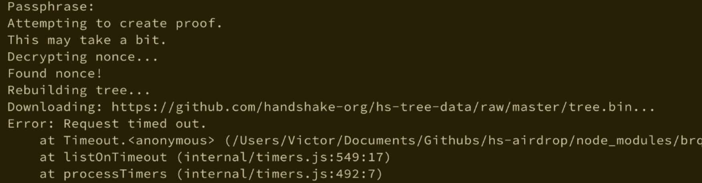
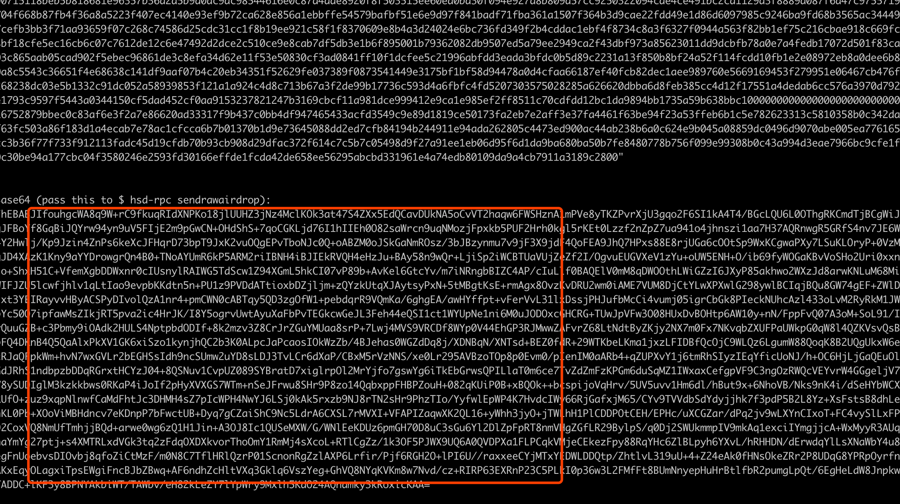
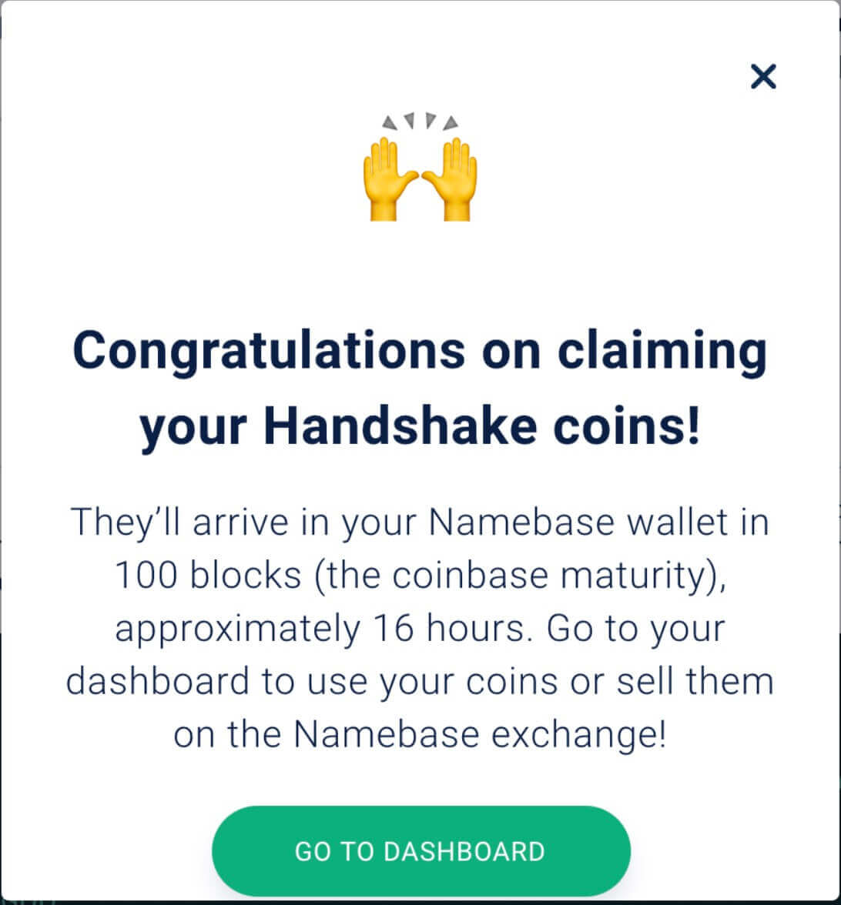
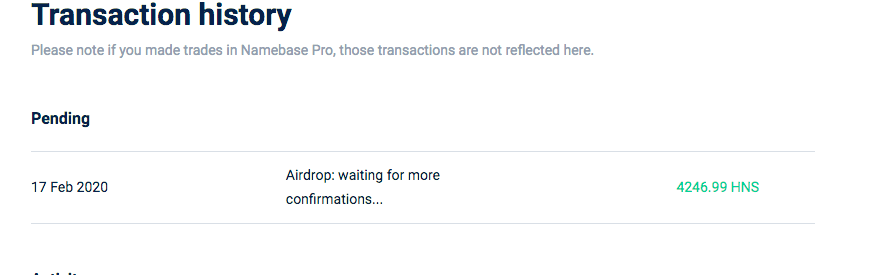
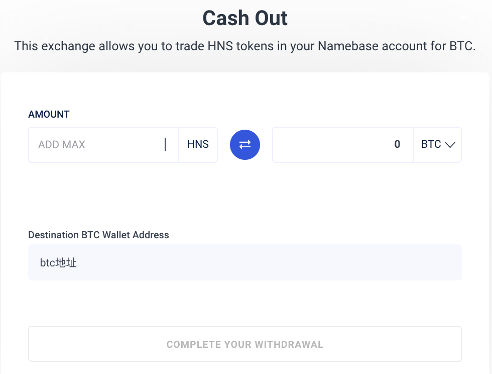

# Handshake 空投

给各位hacker分享一个空投福利，[Handshake](https://handshake.org/) 硬核福利发车了，你有可能领取到`4,246.994314` 枚HNS，目前大概价值 $600，价格一直在变动，各位抓紧哦。

有想具体了解Handshake的，请看[什么是Handshake](https://www.chainnews.com/articles/452340854508.htm)。

既然这么有缘分，大家github互粉下吧，也请关注我们的公众号，谢谢大家。
> 

## 符合条件

以下条件必须都符合的，有一定几率领取到`4,246.994314` 枚HNS，没有发现截止时间。

- `2019-02-04`以前，github已经绑定好ssh key的，请查看 https://github.com/settings/keys

- `2019-02-04`以前，有15个以上 GitHub 好友的

## 如何自己操作：

1. 去[namebase](https://www.namebase.io/register) 注册一个账户

2. 得到一个hns钱包地址

去[namebase的dashboard](https://www.namebase.io/dashboard)，得到地址 `hs1q......`。
> 

3. 下载 hs-airdrop

clone项目 `git clone https://github.com/rebase-network/hs-airdrop`

进入目录安装依赖，执行 `npm install`。

如果有提示`node-gyp rebuild`，需要先安装 `npm install node-gyp`，再执行 `npm install`。

> 

4. 下载hs-tree-data数据

`git clone https://github.com/handshake-org/hs-tree-data  ~/.hs-tree-data`

在验证中奖的过程中，会下载hs-tree-data，国内网络不好的情况下，会出现timeout，所以提前下载下来。

来源：https://github.com/handshake-org/hs-airdrop/issues/57

5. 如何验证中奖

进入到项目根目录，执行 `./bin/hs-airdrop ~/.ssh/id_rsa hs1q......`

`~/.ssh/id_rsa` 是你的github ssh的私钥文件，是私钥，不要用ssh公钥，也不要用钱包地址的私钥，`hs1q......` 是之前得到的hns地址

有`not find nonce`提示，表示**没中奖**，以下内容可以不用看了 :cry:
>

有`Found nonce!`提示，表示**中奖了**，恭喜恭喜！
>

6. 中奖后，需要把币发送的刚申请的hns地址

在上一步验证是否中奖的过程中，如果中奖了会有很多输出内容，并提示 `hsd-rpc sendrawairdrop "base64-string"`
> 

去 [https://www.namebase.io/airdrop](https://www.namebase.io/airdrop)，鼠标滚到最下面，把生成的 `base64-string` 填入进去，然后点击submit。如下图所示。

> 

如果出现 `claimNotNamebaseAddr` 错误提示，请重新申请地址，重复之前的操作。

发送成功后，会有窗口提示。
> 

然后去 [hnscan](https://hnscan.com/) 查看转账记录。

7. 等待到账

大概需要16～24个小时才能到账，也许会更长 :cry:
>

8. 验证个人身份

进入 [https://www.namebase.io/verify/](https://www.namebase.io/verify/)，进行 kyc(Know Your Customer)
你可以通过上传 **中国大陆居民身份证件**验证，如果只用一次，可以上传 fake id card，验证时间不需要很长。

9. 交易

去 [https://www.namebase.io/sell](https://www.namebase.io/sell)，请操盘手开始表演。
> 

## github互粉

1. https://github.com/xrdavies
2. https://github.com/NakaDaoLe
3. https://github.com/h4x3rotab
4. https://github.com/syuukawa
5. https://github.com/luckyyang
6. https://github.com/bitrocks
7. https://github.com/dyhbrewer
8. https://github.com/sanjayzzzhong
9. https://github.com/GalaIO
10. https://github.com/bobjiang
11. https://github.com/WannaM
12. https://github.com/DreamWuGit
13. https://github.com/acbiong
14. https://github.com/libchaos
15. https://github.com/YananLee
16. https://github.com/xiangzhengfeng
17. https://github.com/hmb6668
18. https://github.com/m1365728315
19. https://github.com/TravinC
20. https://github.com/crazygit
21. https://github.com/wangpengpeng
22. https://github.com/wonige
23. https://github.com/weixi87
24. https://github.com/Travin0
25. https://github.com/liwenhoho
26. https://github.com/liuwenchao777
27. https://github.com/liushooter
28. https://github.com/Sniper1211
29. https://github.com/Magua-Q
30. https://github.com/aliasmee
31. https://github.com/mashpolo
32. https://github.com/yyy999
33. https://github.com/zorrolau
34. https://github.com/luoyt
35. https://github.com/taosue
36. https://github.com/zhuxiangdanxi
37. https://github.com/zhanglinx
38. https://github.com/6r6
39. https://github.com/luoyongtao
40. https://github.com/minbinL
41. https://github.com/CP-0
42. https://github.com/wsdo
43. https://github.com/dynamohuang
44. https://github.com/jiaige
45. https://github.com/dong-baby
46. https://github.com/Drafei007
47. https://github.com/adamyi
48. https://github.com/huangyan0914
49. https://github.com/zhuxiangdanxi
50. https://github.com/dong-baby
51. https://github.com/Drafei007
52. https://github.com/raymondnuaa
53. https://github.com/shaozee
54. https://github.com/GaloisLYJ
55. https://github.com/EmiHe
56. https://github.com/ooo-o
57. https://github.com/liuyou6046
58. https://github.com/lulu27753
59. https://github.com/azaliasmee
60. https://github.com/fiowind
61. https://github.com/scottming
62. http://github.com/eular
63. https://github.com/xinxundong
64. https://github.com/lixiaosong
65. https://github.com/netcreen
66. https://github.com/qyliuyawei
67. https://github.com/Eagerdact
68. https://github.com/svein1989
69. https://github.com/BBBob
70. https://github.com/BrunoProgramming
